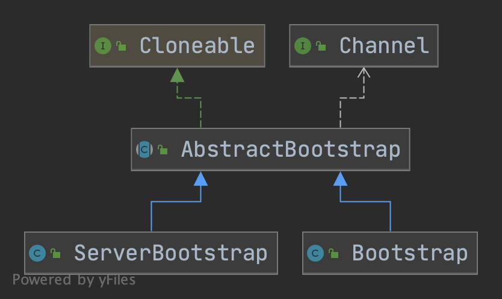
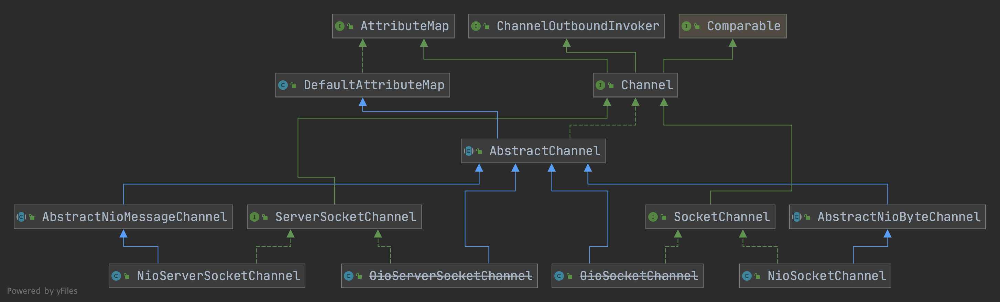
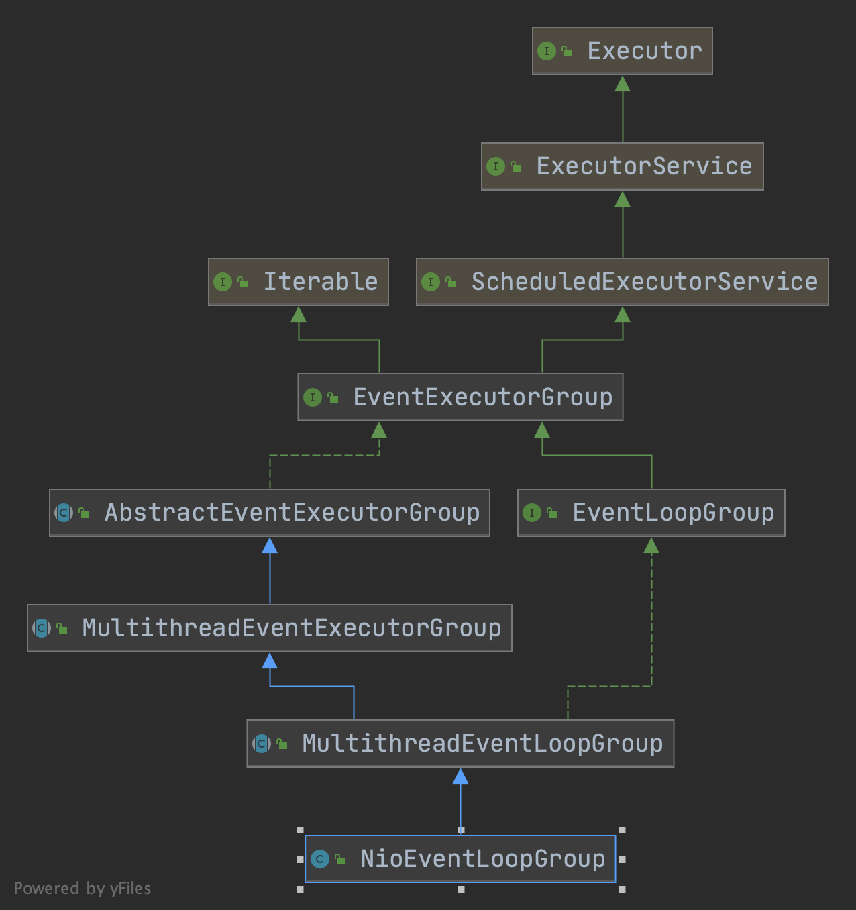
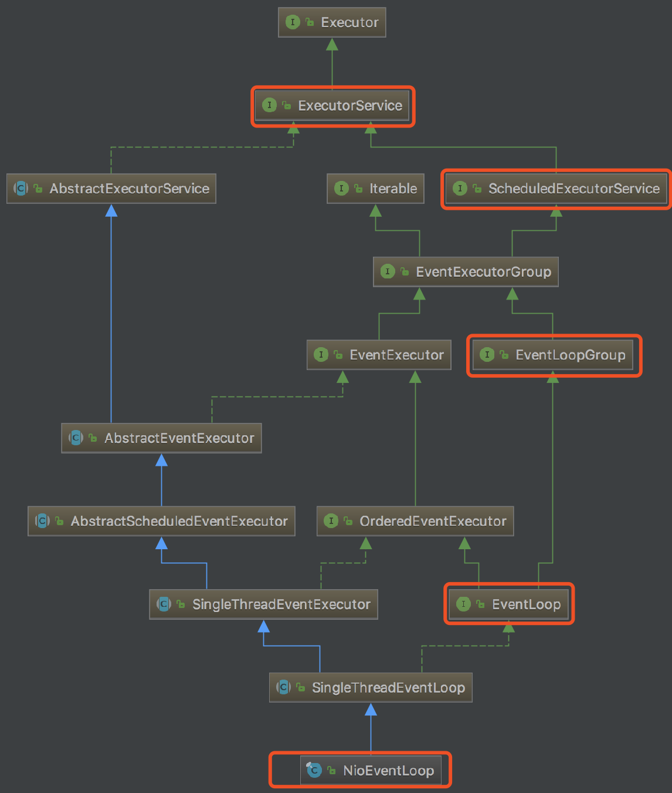
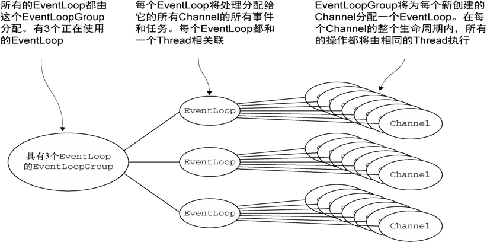
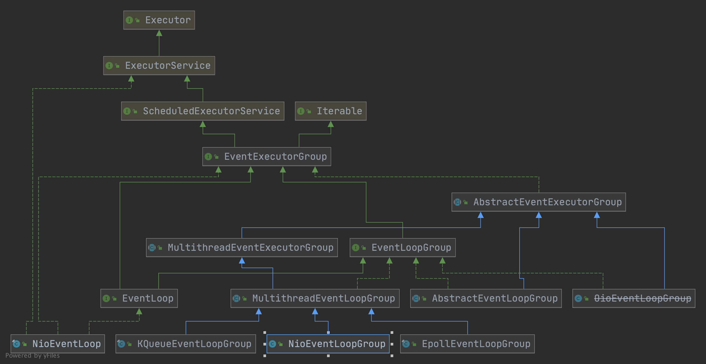
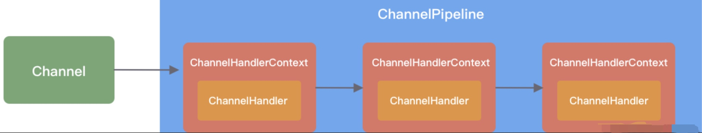
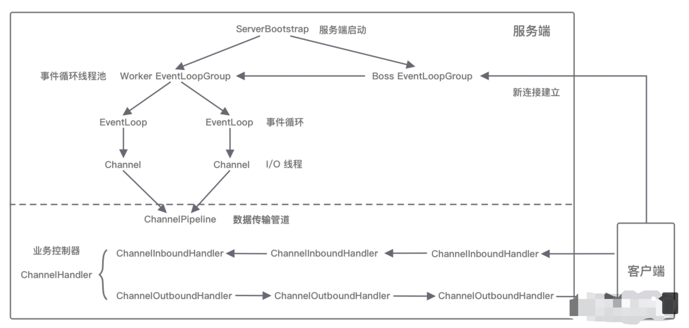
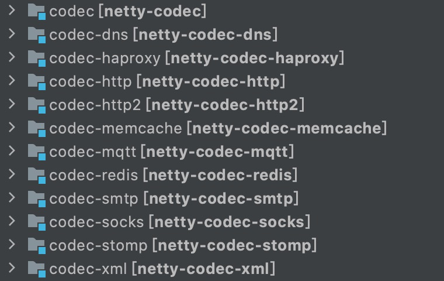

### [Netty 是Java世界里网络编程里绕不开的利器](https://netty.io/)

```
Netty is a NIO client server framework which enables quick and easy development of network applications such as protocol servers and clients. 
It greatly simplifies and streamlines network programming such as TCP and UDP socket server.

'Quick and easy' doesn't mean that a resulting application will suffer from a maintainability or a performance issue. 
Netty has been designed carefully with the experiences earned from the implementation of a lot of protocols such as FTP, SMTP, HTTP, and various binary and text-based legacy protocols. 
As a result, Netty has succeeded to find a way to achieve ease of development, performance, stability, and flexibility without a compromise.
```


1. Core 核心层

Core 核心层是 Netty 最精华的内容，它提供了底层网络通信的通用抽象和实现，包括可扩展的事件模型、通用的通信 API、支持零拷贝的 ByteBuf 等。

2. Protocol Support 协议支持层

协议支持层基本上覆盖了主流协议的编解码实现，如 HTTP、SSL、Protobuf、压缩、大文件传输、WebSocket、文本、二进制等主流协议，此外 Netty 还支持自定义应用层协议。Netty 丰富的协议支持降低了用户的开发成本，基于 Netty 我们可以快速开发 HTTP、WebSocket 等服务。

3. Transport Service 传输服务层

传输服务层提供了网络传输能力的定义和实现方法。它支持 Socket、HTTP 隧道、虚拟机管道等传输方式。Netty 对 TCP、UDP 等数据传输做了抽象和封装，用户可以更聚焦在业务逻辑实现上，而不必关系底层数据传输的细节。

Netty 的模块设计具备较高的通用性和可扩展性，它不仅是一个优秀的网络框架，还可以作为网络编程的工具箱。

### Netty 逻辑架构

Netty 的逻辑处理架构为典型网络分层架构设计，共分为网络通信层、事件调度层、服务编排层。

#### 网络通信层

网络通信层的职责是执行网络 I/O 的操作，它支持多种网络协议和 I/O 模型的连接操作，当网络数据读取到内核缓冲区后，会触发各种网络事件，这些网络事件会分发给事件调度层进行处理。

网络通信层的核心组件包含BootStrap、ServerBootStrap、Channel三个组件。

##### BootStrap 与 ServerBootStrap

Bootstrap 是“引导”的意思，它主要负责整个 Netty 程序的启动、初始化、服务器连接等过程，它相当于一条主线，串联了 Netty 的其他核心组件。

如下图所示类图，Netty 中的引导器共分为两种类型：一个为用于客户端引导的 Bootstrap，另一个为用于服务端引导的 ServerBootStrap，它们都继承自抽象类 AbstractBootstrap。



Bootstrap 和 ServerBootStrap 十分相似，两者非常重要的区别在于 Bootstrap 可用于连接远端服务器，只绑定一个 EventLoopGroup，而 ServerBootStrap 则用于服务端启动绑定本地端口，会绑定两个 EventLoopGroup，这两个 EventLoopGroup 通常称为 Boss 和 Worker。

ServerBootStrap 中的 Boss 和 Worker 类似于分布式系统中的主从关系，每个服务器中都会有一个 Boss，也会有一群做事情的 Worker，Boss 会不停地接收新的连接，然后将连接分配给一个个 Worker 处理连接。

Bootstrap 组件让我们更加方便地配置和启动 Netty 应用程序，它是整个 Netty 的入口，串接了 Netty 所有核心组件的初始化工作。

##### Channel

Channel 的字面意思是“通道”，它是网络通信的载体，Channel提供了基本的 API 用于网络 I/O 操作，如 register、bind、connect、read、write、flush 等。

Netty 自己实现的 Channel 是以 JDK NIO Channel 为基础的，相比较于 JDK NIO，Netty 的 Channel 提供了更高层次的抽象，同时屏蔽了底层 Socket 的复杂性，赋予了 Channel 更加强大的功能，你在使用 Netty 时基本不需要再与 Java Socket 类直接打交道。

下图是 常用的 Channel 家族图谱，AbstractChannel 是整个家族的基类，派生出 AbstractNioChannel、AbstractOioChannel、AbstractEpollChannel 等子类，每一种都代表了不同的 I/O 模型和协议类型。



NioServerSocketChannel 异步 TCP 服务端。

NioSocketChannel 异步 TCP 客户端。

OioServerSocketChannel 同步 TCP 服务端。

OioSocketChannel 同步 TCP 客户端。

NioDatagramChannel 异步 UDP 连接。

OioDatagramChannel 同步 UDP 连接。

Channel 会有多种状态，如连接建立、连接注册、数据读写、连接销毁等。

随着状态的变化，Channel 处于不同的生命周期，每一种状态都会绑定相应的事件回调，下面列举了 Channel 最常见的状态所对应的事件回调：


事件	                                    说明
channelRegistered	    Channel 创建后被注册到 EventLoop 上
channelUnregistered	    Channel 创建后未注册或者从 EventLoop 取消注册
channelActive	        Channel 处于就绪状态，可以被读写
channelInactive	        Channel 处于非就绪状态
channelRead	            Channel 可以从远端读取到数据
channelReadComplete	    Channel 读取数据完成

##### 总结

BootStrap 和 ServerBootStrap 分别负责客户端和服务端的启动，它们是非常强大的辅助工具类

Channel 是网络通信的载体，提供了与底层 Socket 交互的能，那么 Channel 生命周期内的事件都是如何被处理的呢？那就是 Netty 事件调度层的工作职责了。

#### 事件调度层

事件调度层的职责是通过 Reactor 线程模型对各类事件进行聚合处理，通过 Selector 主循环线程集成多种事件（ I/O 事件、信号事件、定时事件等），实际的业务处理逻辑是交由服务编排层中相关的 Handler 完成。

事件调度层的核心组件包括EventLoopGroup、EventLoop。





##### EventLoopGroup & EventLoop

EventLoopGroup 本质是一个线程池，主要负责接收 I/O 请求，并分配线程执行处理请求。

在下图中，我为你讲述了 EventLoopGroups、EventLoop 与 Channel 的关系：



从上图中，我们可以总结出 EventLoopGroup、EventLoop、Channel 的几点关系：

一个 EventLoopGroup 往往包含一个或者多个 EventLoop。EventLoop 用于处理 Channel 生命周期内的所有 I/O 事件，如 accept、connect、read、write 等 I/O 事件。

EventLoop 同一时间会与一个线程绑定，每个 EventLoop 负责处理多个 Channel。

每新建一个 Channel，EventLoopGroup 会选择一个 EventLoop 与其绑定。该 Channel 在生命周期内都可以对 EventLoop 进行多次绑定和解绑。

可以看出 Netty 提供了 EventLoopGroup 的多种实现，而且 EventLoop 则是 EventLoopGroup 的子接口，所以也可以把 EventLoop 理解为EventLoopGroup，但是它只包含一个 EventLoop 。

下图是 EventLoopGroup 的家族图谱：



EventLoopGroup 的实现类是 NioEventLoopGroup，NioEventLoopGroup 也是 Netty 中最被推荐使用的线程模型。

NioEventLoopGroup 继承于 MultithreadEventLoopGroup，是基于 NIO 模型开发的，可以把 NioEventLoopGroup 理解为一个线程池，每个线程负责处理多个 Channel，而同一个 Channel 只会对应一个线程。

EventLoopGroup 是 Netty 的核心处理引擎，那么EventLoopGroup和 Reactor 线程模型到底是什么关系呢？

EventLoopGroup 是 Netty Reactor 线程模型的具体实现方式，Netty 通过创建不同的 EventLoopGroup 参数配置，就可以支持 Reactor 的三种线程模型：

1、单线程模型：EventLoopGroup 只包含一个 EventLoop，Boss 和 Worker 使用同一个EventLoopGroup；

2、多线程模型：EventLoopGroup 包含多个 EventLoop，Boss 和 Worker 使用同一个EventLoopGroup；

3、主从多线程模型：EventLoopGroup 包含多个 EventLoop，Boss 是主 Reactor，Worker 是从 Reactor，它们分别使用不同的 EventLoopGroup，主 Reactor 负责新的网络连接 Channel 创建，然后把 Channel 注册到从 Reactor。

#### 服务编排层

服务编排层的职责是负责组装各类服务，它是 Netty 的核心处理链，用以实现网络事件的动态编排和有序传播。

服务编排层的核心组件包括ChannelPipeline、ChannelHandler、ChannelHandlerContext。

##### ChannelPipeline

ChannelPipeline 是 Netty 的核心编排组件，负责组装各种 ChannelHandler，实际数据的编解码以及加工处理操作都是由 ChannelHandler 完成的，ChannelPipeline 可以理解为ChannelHandler 的实例列表——内部通过双向链表将不同的 ChannelHandler 链接在一起，当 I/O 读写事件触发时，ChannelPipeline 会依次调用 ChannelHandler 列表对 Channel 的数据进行拦截和处理。

ChannelPipeline 是线程安全的，因为每一个新的 Channel 都会对应绑定一个新的 ChannelPipeline。一个 ChannelPipeline 关联一个 EventLoop，一个 EventLoop 仅会绑定一个线程。

ChannelPipeline、ChannelHandler 都是高度可定制的组件，可以通过这两个核心组件掌握对 Channel 数据操作的控制权。

下面我们看一下 ChannelPipeline 的结构图：
```
+---------------------------------------------------+---------------+
|                           ChannelPipeline         |               |
|                                                  \|/              |
|    +---------------------+            +-----------+----------+    |
|    | Inbound Handler  N  |            | Outbound Handler  1  |    |
|    +----------+----------+            +-----------+----------+    |
|              /|\                                  |               |
|               |                                  \|/              |
|    +----------+----------+            +-----------+----------+    |
|    | Inbound Handler N-1 |            | Outbound Handler  2  |    |
|    +----------+----------+            +-----------+----------+    |
|              /|\                                  .               |
|               .                                   .               |
| ChannelHandlerContext.fireIN_EVT() ChannelHandlerContext.OUT_EVT()|
|        [ method call]                       [method call]         |
|               .                                   .               |
|               .                                  \|/              |
|    +----------+----------+            +-----------+----------+    |
|    | Inbound Handler  2  |            | Outbound Handler M-1 |    |
|    +----------+----------+            +-----------+----------+    |
|              /|\                                  |               |
|               |                                  \|/              |
|    +----------+----------+            +-----------+----------+    |
|    | Inbound Handler  1  |            | Outbound Handler  M  |    |
|    +----------+----------+            +-----------+----------+    |
|              /|\                                  |               |
+---------------+-----------------------------------+---------------+
               |                                  \|/
+---------------+-----------------------------------+---------------+
|               |                                   |               |
|       [ Socket.read() ]                    [ Socket.write() ]     |
|                                                                   |
|  Netty Internal I/O Threads (Transport Implementation)            |
+-------------------------------------------------------------------+
```

1、客户端和服务端都有各自的 ChannelPipeline，以客户端为例，数据从客户端发向服务端，该过程称为出站，反之则称为入站。

2、数据入站会由一系列 InBoundHandler 处理，然后再以相反方向的 OutBoundHandler 处理后完成出站。

3、开发经常使用的编码 Encoder 是出站操作，解码 Decoder 是入站操作。

4、服务端接收到客户端数据后，需要先经过 Decoder 入站处理后，再通过 Encoder 出站通知客户端。

5、客户端和服务端一次完整的请求应答过程可以分为三个步骤：客户端出站（请求数据）、服务端入站（解析数据并执行业务逻辑）、服务端出站（响应结果）。

##### ChannelHandler & ChannelHandlerContext
      
下图描述了 Channel 与ChannelPipeline 的关系，从图中可以看出，每创建一个 Channel 都会绑定一个新的 ChannelPipeline，ChannelPipeline 中每加入一个 ChannelHandler 都会绑定一个 ChannelHandlerContext，由此可见，ChannelPipeline、ChannelHandlerContext、ChannelHandler 三个组件的关系是密切相关的，那么你一定会有疑问，每个ChannelHandler绑定ChannelHandlerContext 的作用是什么呢？



ChannelHandlerContext 用于保存 ChannelHandler 上下文，通过 ChannelHandlerContext 我们可以知道 ChannelPipeline 和 ChannelHandler 的关联关系。

ChannelHandlerContext 可以实现 ChannelHandler 之间的交互，ChannelHandlerContext 包含了 ChannelHandler 生命周期的所有事件，如 connect、bind、read、flush、write、close 等。

你可以试想这样一个场景，如果每个 ChannelHandler 都有一些通用的逻辑需要实现，没有 ChannelHandlerContext 这层模型抽象，你是不是需要写很多相同的代码呢？

##### Netty 组件关系图



1、服务端启动初始化时有 Boss EventLoopGroup 和 Worker EventLoopGroup 两个组件，其中 Boss 负责监听网络连接事件，当有新的网络连接事件到达时，则将 Channel 注册到 Worker EventLoopGroup。

2、Worker EventLoopGroup 会被分配一个 EventLoop 负责处理该 Channel 的读写事件，每个 EventLoop 都是单线程的，通过 Selector 进行事件循环。

3、当客户端发起 I/O 读写事件时，服务端 EventLoop 会进行数据的读取，然后通过 Pipeline 触发各种监听器进行数据的加工处理。

4、客户端数据会被传递到 ChannelPipeline 的第一个 ChannelInboundHandler 中，数据处理完成后，将加工完成的数据传递给下一个 ChannelInboundHandler。

5、当数据写回客户端时，会将处理结果在 ChannelPipeline 的 ChannelOutboundHandler 中传播，最后到达客户端。

### Core 核心层模块

netty-common模块：Netty 的核心基础包，提供了丰富的工具类，其他模块都需要依赖它，在 common 模块中，常用的包括通用工具类和自定义并发包。

  1、通用工具类：比如定时器工具 TimerTask、时间轮 HashedWheelTimer 等。
    
  2、自定义并发包：比如异步模型****Future & Promise、相比 JDK 增强的 FastThreadLocal 等。

netty-buffer模块：Netty自己实现了的一个更加完备的ByteBuf 工具类，用于网络通信中的数据载体，由于人性化的 Buffer API 设计，它已经成为 Java ByteBuffer 的完美替代品，ByteBuf 的动态性设计不仅解决了 ByteBuffer 长度固定造成的内存浪费问题，而且更安全地更改了 Buffer 的容量，此外 Netty 针对 ByteBuf 做了很多优化，例如缓存池化、减少数据拷贝的 CompositeByteBuf 等。

netty-resolver模块：主要提供了一些有关基础设施的解析工具，包括 IP Address、Hostname、DNS 等。

### Protocol Support 协议支持层模块

netty-codec模块：主要负责编解码工作，通过编解码实现原始字节数据与业务实体对象之间的相互转化。

如下图所示，Netty 支持了大多数业界主流协议的编解码器，如 HTTP、HTTP2、Redis、XML 等，为开发者节省了大量的精力，此外该模块提供了抽象的编解码类 ByteToMessageDecoder 和 MessageToByteEncoder，通过继承这两个类我们可以轻松实现自定义的编解码逻辑。



### Transport Service 传输服务层模块

netty-transport 模块：可以说是 Netty 提供数据处理和传输的核心模块，该模块提供了很多非常重要的接口，如 Bootstrap、Channel、ChannelHandler、EventLoop、EventLoopGroup、ChannelPipeline 等。

Bootstrap 负责客户端或服务端的启动工作，包括创建、初始化 Channel 等

EventLoop 负责向注册的 Channel 发起 I/O 读写操作

ChannelPipeline 负责 ChannelHandler 的有序编排

